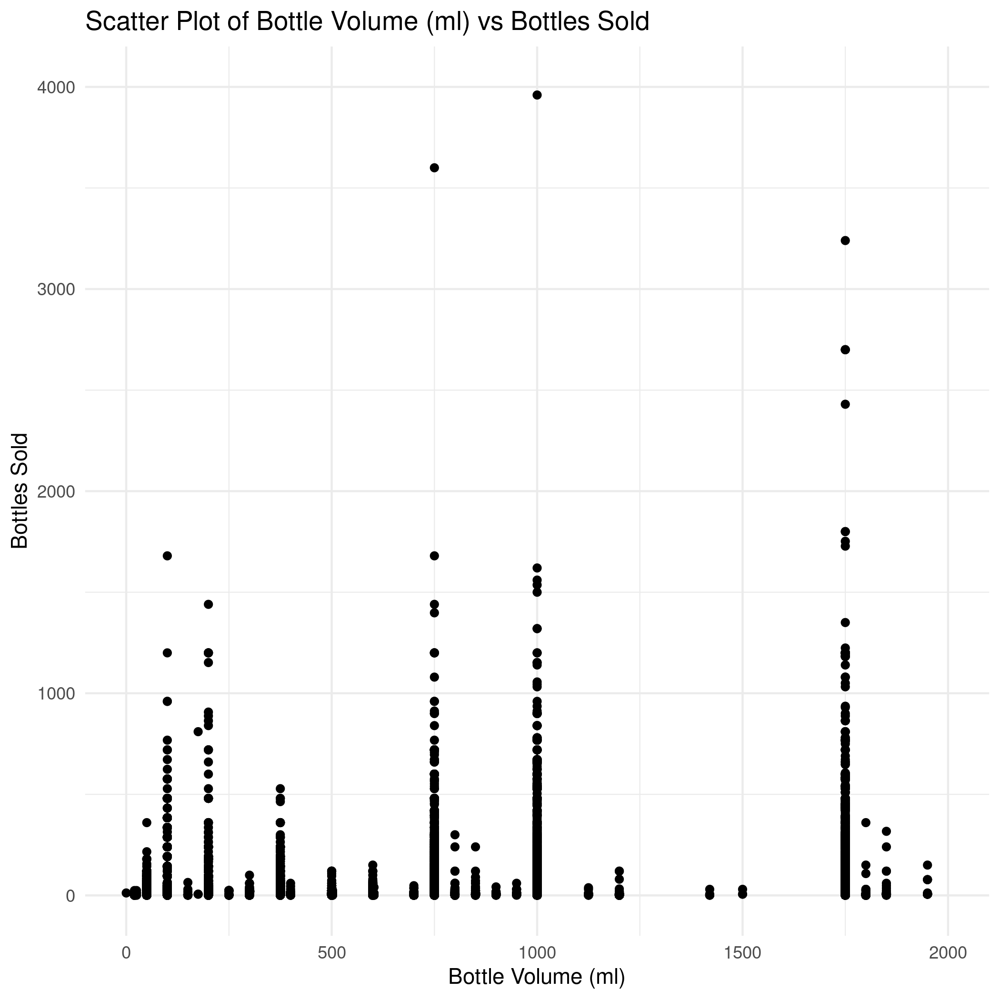

# Nikola Vukic E2 68-2023

## Specifikacija

Kompletnu specifikaciju za projekat moguce je pronaci [ovde](/home/nikola/Master/R/RVPII/assets/specifikacija.pdf). <br>
Skup podataka je javno dostupan za [preuzimanje](https://catalog.data.gov/dataset/iowa-liquor-sales). <br>

## Instalacija potrebnih resursa

```{r instalacija, eval=FALSE, include=TRUE}
library(sparklyr)
library(ggplot2)
library(tidyr)
library(dplyr)
library(magrittr)
library(knitr)

spark_install(version = "3.5.1")
knitr::opts_knit$set(root.dir = "/home/nikola/Master/R/RVPII-projekat")
```

## Priprema podataka

U ovoj fazi bice izbaceni redovi koji sadrze vrednosti obelezja koja nisu dostupna (*NA*). Pored ovoga bice izbacene i kolone tj. obelezja koja nisu relevantna za formiranje modela. Dok ce neka polja biti transformisana za potrebe lakseg formiranja modela.
```{r preciscivanje-podataka, eval=FALSE, include=TRUE}
conf <- spark_config()
conf$`sparklyr.shell.driver-memory` <- "12G"
conf$spark.memory.fraction <- 0.9

sc <- spark_connect(master = "local", config = conf)

path_to_raw_file <- file.path(getwd(), "Iowa_Liquor_Sales.csv")
output_file <- file.path(getwd(), "Iowa_Liquor_Sales")

# Read the data
df <- spark_read_csv(sc, path_to_raw_file)

# Drop irrelevant columns
columns_to_drop <- c(
  "InvoiceItem_Number",
  "Store_Number",
  "Store_Name",
  "Address",
  "City",
  "County",
  "Vendor_Name",
  "Zip_Code",
  "County_Number",
  "Category",
  "County",
  "Vendor_Number",
  "Item_Number",
  "Item_Description"
)

df <- df %>% select(-one_of(columns_to_drop))

# Convert Date column to date format
df <- df %>%
  mutate(Date = to_date(Date, 'MM/dd/yyyy'))

# Remove rows with NA values
df <- df %>% na.omit()

# Check data
glimpse(df)

# Summarize and get top 10 categories
df_count <- df %>%
  group_by(Category_Name) %>%
  summarise(count = n()) %>%
  arrange(desc(count))

top_categories <- df_count %>%
  head(19) %>%
  collect() %>%
  pull(Category_Name)

print(top_categories)

# Create Category_Group column
df <- df %>%
  mutate(
    Category_Group = case_when(
      Category_Name %in% top_categories ~ as.character(Category_Name),
      TRUE ~ "Other"
    )
  ) %>%
  select(-Category_Name)

# Check data again
glimpse(df)

# Sample 30% of the data
df_sample <- df %>% sdf_sample(fraction = 0.3, replacement = FALSE)

category_counts <- df_sample %>%
  group_by(Category_Group) %>%
  summarise(Count = n()) %>%
  collect()

print(category_counts)

if("Other" %in% category_counts$Category_Group) {
  other_count <- filter(category_counts, Category_Group == "Other")$Count
} else {
  other_count <- 0
}

non_other_count <- sum(category_counts$Count) - other_count

# Printing results
cat(sprintf("Count of 'Other': %d\n", other_count))
cat(sprintf("Count of non-'Other': %d\n", non_other_count))

df_filtered <- df %>% filter(Category_Group != "Other")

row_count <- df_filtered %>% count() %>% collect() %>% pull(n)

# Print the number of rows in df_sample
cat(sprintf("The number of rows in df_filtered is: %d\n", row_count))

# Write the sampled data to CSV
spark_write_csv(df_filtered, path = output_file, mode = "overwrite", delimiter = ",")

```

## Preliminarna analiza podataka

### Korelaciona matrica numerickih obelezja

```{r korelaciona-matrica-obelezja, eval=FALSE, include=FALSE}
conf <- spark_config()
conf$`sparklyr.shell.driver-memory` <- "12G"
conf$spark.memory.fraction <- 0.9

sc <- spark_connect(master = "local", config = conf)

df <- spark_read_csv(sc, "Iowa_Liquor_Sales")

glimpse(df)

category_mapping <- df %>%
  select(Category_Group) %>%
  distinct() %>%
  mutate(Category_Index = monotonically_increasing_id())

mapped_df <- df %>%
  left_join(category_mapping, by = "Category_Group")

glimpse(mapped_df)

numeric_df <- mapped_df %>%
  select_if(is.numeric)

glimpse(numeric_df)

row_count <- numeric_df %>% count() %>% collect() %>% pull(n)

cat(sprintf("The number of rows in numeric_df is: %d\n", row_count))

sampled_numeric_df <- numeric_df %>% 
  sdf_sample(fraction = 0.1, replacement = FALSE) %>%
  collect()

correlation_matrix <- cor(sampled_numeric_df)

library(ggcorrplot)

p <- ggcorrplot(cor(correlation_matrix), hc.order = TRUE,
           type = "lower",
           lab = TRUE, 
           ggtheme = ggplot2::theme_gray,
           colors = c("#5986f0", "white", "#f05959"))
# Save the ggplot object as an image file
ggsave("assets/correlation_plot.png", p)
```


