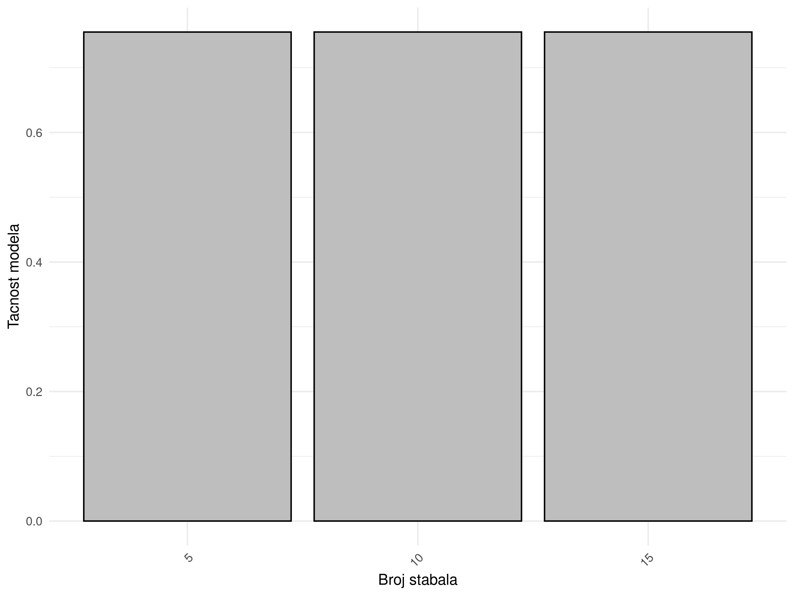

# Nikola Vukic E2 68-2023

## Specifikacija

Kompletnu specifikaciju za projekat moguce je pronaci [ovde](/home/nikola/Master/R/RVPII-projekat/specifikacija.pdf). <br>
Skup podataka je javno dostupan za [preuzimanje](https://catalog.data.gov/dataset/iowa-liquor-sales). <br>

## Instalacija potrebnih resursa

```{r instalacija, eval=FALSE, include=TRUE}
library(sparklyr)
library(ggplot2)
library(tidyr)
library(dplyr)
library(magrittr)
library(knitr)
library(ggcorrplot)

spark_install(version = "3.5.1")
knitr::opts_knit$set(root.dir = "/home/nikola/Master/R/RVPII-projekat")
```

## Priprema podataka

U ovoj fazi bice izbaceni redovi koji sadrze vrednosti obelezja koja nisu dostupna (*NA*). Pored ovoga bice izbacene i kolone tj. obelezja koja nisu relevantna za formiranje modela. 

```{r preciscivanje-podataka, eval=FALSE, include=TRUE}
conf <- spark_config()
conf$`sparklyr.shell.driver-memory` <- "16G"
conf$spark.memory.fraction <- 0.9

sc <- spark_connect(master = "local", config = conf)

path_to_raw_file <- file.path(getwd(), "Iowa_Liquor_Sales.csv")
output_file <- file.path(getwd(), "Iowa_Liquor_Sales")

df <- spark_read_csv(sc, path_to_raw_file)

columns_to_drop <- c(
  "Date",
  "InvoiceItem_Number",
  "Store_Number",
  "Store_Name",
  "Category_Name",
  "Address",
  "City",
  "Store_Location",
  "County",
  "Vendor_Name",
  "Zip_Code",
  "County_Number",
  "Category",
  "County",
  "Vendor_Number",
  "Item_Number",
  "Item_Description",
  "Category_Group",
  "Volume_Sold_Gallons",
  "State_Bottle_Retail"
)

df <- df %>% 
  select(-one_of(columns_to_drop)) %>%
  filter(Pack >= 0) %>%
  filter(Bottles_Sold < 100) %>%
  filter(Bottle_Volume_ml >= 0) %>%
  filter(State_Bottle_Cost >= 0) %>%
  filter(Bottles_Sold >= 0) %>%
  filter(Sale_Dollars >= 0) %>%
  filter(Volume_Sold_Liters >= 0)

df <- df %>% na.omit()

df_sample <- df %>% sdf_sample(fraction = 0.3, replacement = FALSE)

spark_write_csv(df_sample, path = output_file, mode = "overwrite", delimiter = ",")
```

## Preliminarna analiza podataka

### 1. Deskriptivna statistika 

```{r deskriptivna-statistika, eval=FALSE, include=TRUE}
df <- spark_read_csv(sc, "Iowa_Liquor_Sales")

column_names <- colnames(df)

calculate_summary <- function(col_name) {
  df %>%
    summarize(
      count = n(),
      min = min(!!sym(col_name)),
      max = max(!!sym(col_name)),
      mean = mean(!!sym(col_name)),
      median = percentile_approx(!!sym(col_name), 0.5)
    )
}

summary_stats_list <- lapply(column_names, function(col) {
  calculate_summary(col) %>%
    collect()
})

summary_matrix <- do.call(rbind, summary_stats_list)

summary_matrix_df <- as.data.frame(summary_matrix)

rownames(summary_matrix_df) <- column_names

descriptive_statistics_matrix <- kable(summary_matrix_df, "html") 

writeLines(descriptive_statistics_matrix, "assets/descriptive_statistics_matrix.html") 
```
**Rezultat racunanja deskriptivne stattisike polja:**

<iframe src="assets/descriptive_statistics_matrix.html" style="margin: 0 auto; display: block;" width="465px" height="180px"></iframe>

### 2. Vizualizovanje raspodele po pojedinacnim obelezjima

```{r sampling-utils, eval=FALSE, include=FALSE}
sample_df <- sdf_sample(df, 0.5, TRUE, 123)
```

```{r vr-Bottles_Sold, eval=FALSE, include=FALSE }
grouped_df <- sample_df %>%
  group_by(Bottles_Sold) %>%
  summarise(count = n()) %>%
  collect()

glimpse(grouped_df)

hist <- ggplot(grouped_df, aes(x = Bottles_Sold, y = count)) +
  geom_bar(stat = "identity", fill = "black") +
  labs(
    x = "Broj prodanih flasa",
    y = "Broj kupovina"
  ) +
  scale_x_continuous(limits = c(0, 1000), labels = scales::comma, breaks = seq(0, 1000, by = 200)) +  # Adjust the upper limit to 1000
  scale_y_continuous(labels = scales::comma, breaks = seq(0, 1000, by = 200)) +  # Adjust the upper limit to 1000 for y-axis as well
  theme_minimal() +
  theme(axis.text.x = element_text(angle = 45, hjust = 1))

# Save the modified histogram
png_filename <- "assets/bottles_sold.png"
ggsave(
  filename = png_filename, 
  plot = hist, 
  width = 10, height = 6, dpi = 300
)
```

### 3. Korelaciona matrica obelezja

```{r korelaciona-matrica-obelezja, eval=FALSE, include=TRUE}
sampled_numeric_df <- df %>% 
  sdf_sample(fraction = 0.7, replacement = FALSE) %>%
  collect()

correlation_matrix <- cor(sampled_numeric_df)

p <- ggcorrplot(cor(correlation_matrix), hc.order = TRUE,
           type = "lower",
           lab = TRUE, 
           ggtheme = ggplot2::theme_gray,
           colors = c("#5986f0", "white", "#f05959"))
ggsave("assets/correlation_plot.png", p)
```

**Matrica korelacije:**


## Klasifikacija

```{r kreiranje-validacionog-skupa, eval=FALSE, include=TRUE}
clusterisation_dataset <- sdf_random_split(
  df, 
  seed=123, 
  training=0.7,
  validation=0.3
)

training <- clusterisation_dataset$training 
validation <- clusterisation_dataset$validation 

formula <- Bottles_Sold ~ State_Bottle_Cost + Volume_Sold_Liters

size <- c(1:3)
max_iters <- size * 10
max_depths <- size * 5
```

### 1. Stabla odlucivanja

##### Obucavanje i evaluacija tacnosti 

```{r decision-tree-classifier, eval=FALSE, include=TRUE}
accuracies <- size

for(i in size) {
  model <- training %>%
    ml_decision_tree_classifier(formula, max_depth = max_depths[[i]])

  eval <- ml_evaluate(model, validation)
  
  accuracies[i] <- eval$Accuracy
}

dtc_accuracies <- accuracies
```

```{r dtc-depth-vs-accuracy, eval=FALSE, include=TRUE}
results_df <- data.frame(max_depth = max_depths, accuracy = accuracies)

p <- ggplot(results_df, aes(x = factor(max_depth), y = accuracy)) +
  geom_bar(stat = "identity", fill = "grey", color = "black") +  
  labs(x = "Maksimalna dubina",
       y = "Tacnost modela") +
  theme_minimal() +
  theme(axis.text.x = element_text(angle = 45, hjust = 1))

ggsave("assets/dtc_max_depth_vs_accuracy.png", plot = p, width = 8, height = 6)
```

**Rezultujuci grafikon: **


#### Evaluacija preciznosti unakrsnom validacijom


```{r dtc-validation, eval=FALSE, include=TRUE}
pip <- sc %>% 
    ml_pipeline() %>%
    ft_r_formula(formula) %>%
    ml_decision_tree_classifier()

param_grid <- list(
  decision_tree_classifier = list(max_depth = max_depths)
)

evaluator <- ml_multiclass_classification_evaluator(
  x=sc, 
  metric_name="accuracy"
)

validator <- ml_cross_validator(
  x=sc, 
  estimator=pip, 
  evaluator=evaluator, 
  estimator_param_maps=param_grid, 
  num_folds=5
)

fit <- ml_fit(x = validator, dataset = df)
metrics <- ml_validation_metrics(fit)

p <- metrics %>%
  ggplot(aes(x = factor(max_depths), y = accuracy)) + 
  geom_bar(stat = "identity", fill = "grey", color = "black") +
  labs(x = "Maksimalna dubina",
       y = "Tacnost modela")

ggsave("assets/dtc_k_fold_validation.png", p)
```

**Tacnost u zavisnosti od dubine, procena napravljena unakrsenom validacijom:**


### 2. Logisticka regresija

##### Obucavanje i ocena performansi

```{r logistic-regression, eval=FALSE, include=TRUE}
lr_precs <- size
lr_recalls <- size
lr_f_measures <- size
lr_accuracies <- size

for(i in size) {
  model <- ml_logistic_regression(training, formula, max_iter = max_iters[[i]])
  eval <- ml_evaluate(model, validation)
  lr_precs[i] <- eval$weighted_precision()
  lr_recalls[i] <- eval$weighted_recall()
  lr_f_measures[i] <- eval$weighted_f_measure()
  lr_accuracies[i] <- eval$accuracy()
}
```

```{r lr-max-iters-vs-accuracy, eval=FALSE, include=TRUE}
results_df <- data.frame(max_depth = max_iters, accuracy = lr_accuracies)

p <- ggplot(results_df, aes(x = factor(max_depth), y = accuracy)) +
  geom_bar(stat = "identity", fill = "grey", color = "black") +  
  labs(x = "Broj iteracija",
       y = "Tacnost modela") +
  theme_minimal() +
  theme(axis.text.x = element_text(angle = 45, hjust = 1))

ggsave("assets/lr_max_iters_vs_accuracy.png", plot = p, width = 8, height = 6)

results_df <- data.frame(max_depth = max_iters, accuracy = lr_f_measures)

p <- ggplot(results_df, aes(x = factor(max_depth), y = accuracy)) +
  geom_bar(stat = "identity", fill = "grey", color = "black") +  
  labs(x = "Broj iteracija",
       y = "Rezultujuci F1-skor") +
  theme_minimal() +
  theme(axis.text.x = element_text(angle = 45, hjust = 1))

ggsave("assets/lr_max_iters_vs_lr_f_measures.png", plot = p, width = 8, height = 6)

results_df <- data.frame(max_depth = max_iters, accuracy = lr_recalls)

p <- ggplot(results_df, aes(x = factor(max_depth), y = accuracy)) +
  geom_bar(stat = "identity", fill = "grey", color = "black") +  
  labs(x = "Broj iteracija",
       y = "Osetljivost modela") +
  theme_minimal() +
  theme(axis.text.x = element_text(angle = 45, hjust = 1))

ggsave("assets/lr_max_iters_vs_lr_recalls.png", plot = p, width = 8, height = 6)

results_df <- data.frame(max_depth = max_iters, accuracy = lr_precs)

p <- ggplot(results_df, aes(x = factor(max_depth), y = accuracy)) +
  geom_bar(stat = "identity", fill = "grey", color = "black") +  
  labs(x = "Broj iteracija",
       y = "Preciznost modela") +
  theme_minimal() +
  theme(axis.text.x = element_text(angle = 45, hjust = 1))

ggsave("assets/lr_max_iters_vs_lr_precs.png", plot = p, width = 8, height = 6)
```
 
**Rezultujuci grafikoni:**
 


#### Evaluacija preciznosti unakrsnom validacijom

```{r lr-validation, eval=FALSE, include=TRUE}
pip <- sc %>% 
    ml_pipeline() %>%
    ft_r_formula(formula) %>%
    ml_logistic_regression()

param_grid <- list(
  logistic_regression = list(max_iter = max_iters)
)

evaluator <- ml_multiclass_classification_evaluator(
  x = sc, 
  metric_name = "accuracy"
)

validator <- ml_cross_validator(
  x = sc, estimator = pip, 
  evaluator=evaluator, 
  estimator_param_maps=param_grid, 
  num_folds=5
)

fit <- ml_fit(x = validator, dataset = df)
metrics <- ml_validation_metrics(fit)

p <- metrics %>%
  ggplot(aes(x = factor(max_depths), y = accuracy)) + 
  geom_bar(stat = "identity", fill = "grey", color = "black") +
  labs(x = "Maksimalan broj iteracija",
       y = "Preciznost modela")

ggsave("assets/lr_k_fold_validation.png", p)
```

**Tacnost u zavisnosti od maksimalnog broja iteracija, procena napravljena unakrsenom validacijom:**


### 3. Random Forest

##### Obucavanje i ocena tacnosti

```{r random-forest, eval=FALSE, include=TRUE}
rf_accuracies <- matrix(nrow = 3, ncol = 3)

tree_count <- max_depths

for(i in size) {
  for(j in size) {
    model <- ml_random_forest_classifier(
      training,
      formula, 
      num_trees = tree_count[[i]], 
      max_depth = max_depths[[j]]
    )
    eval <- ml_evaluate(model, validation)
    
    rf_accuracies[i, j] <- eval$Accuracy
  }
}
```

```{r rf-tree-count-vs-accuracy, eval=FALSE, include=TRUE}
results_df <- data.frame(num_trees = tree_count, accuracy = rf_accuracies)

p <- ggplot(results_df, aes(x = factor(tree_count), y = accuracy)) +
  geom_bar(stat = "identity", fill = "grey", color = "black") +  
  labs(x = "Broj stabala",
       y = "Tacnost modela") +
  theme_minimal() +
  theme(axis.text.x = element_text(angle = 45, hjust = 1))

ggsave("assets/rf_tree_count_vs_accuracy.png", plot = p, width = 8, height = 6)
```


