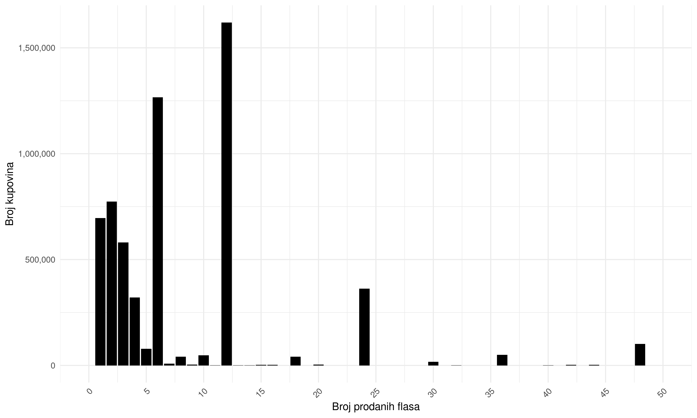
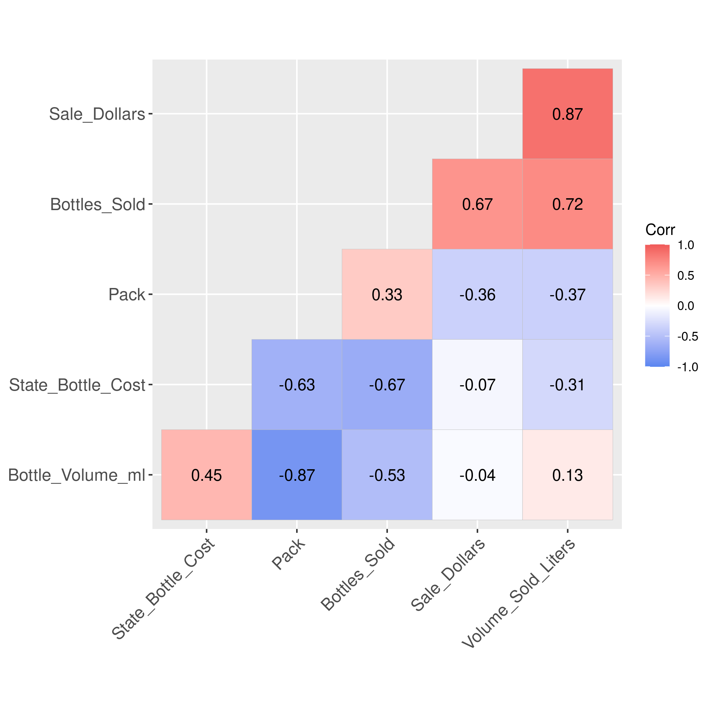
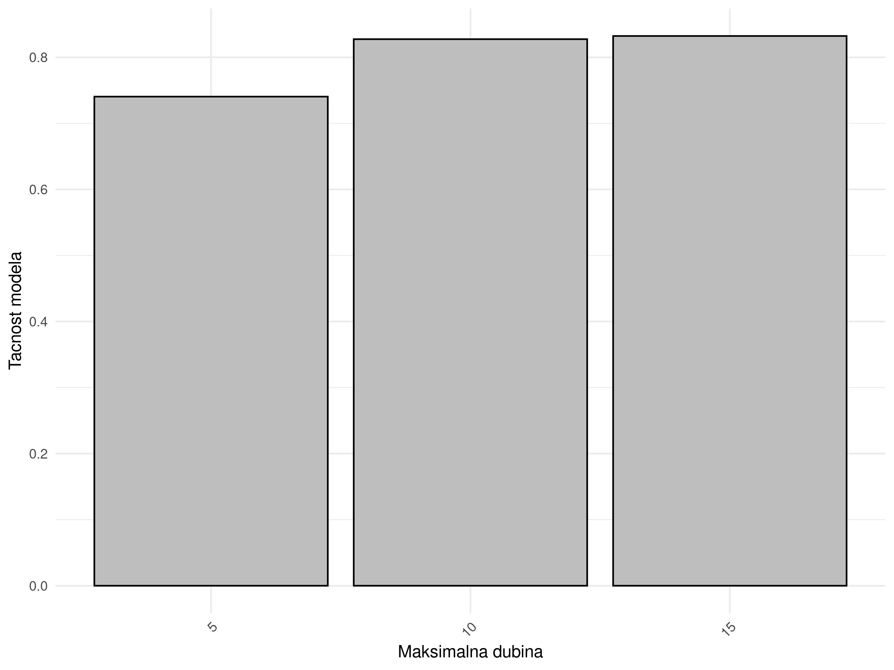

## Specifikacija

Kompletnu specifikaciju za projekat moguce je pronaci [ovde](/home/nikola/Master/R/RVPII-projekat/specifikacija.pdf). <br>
Skup podataka je javno dostupan za [preuzimanje](https://catalog.data.gov/dataset/iowa-liquor-sales). <br>
Projekat je pisan u programskom jeziku *R*. Koristi *spark* alat stoga je neophodna *JVM* instalacija. Pored ovoga neophodna je instalacija paketa, za sta je potreban *make* alat. Potrebne biblioteke su navedene u sledecem komadu koda.

## Instalacija potrebnih resursa

```{r instalacija, eval=FALSE, include=TRUE}
library(sparklyr)
library(ggplot2)
library(tidyr)
library(dplyr)
library(magrittr)
library(knitr)
library(ggcorrplot)
library(reshape2)
library(scales)

spark_install(version = "3.5.1")
knitr::opts_knit$set(root.dir = "/home/nikola/Master/R/RVPII-projekat")
```

## Priprema podataka

U ovoj fazi bice izbaceni redovi koji sadrze vrednosti obelezja koja nisu dostupna (*NA*). Pored ovoga bice izbacene i kolone tj. obelezja koja nisu relevantna za formiranje modela. 

```{r preciscivanje-podataka, eval=FALSE, include=TRUE}
conf <- spark_config()
conf$`sparklyr.shell.driver-memory` <- "16G"
conf$spark.memory.fraction <- 0.9

sc <- spark_connect(master = "local", config = conf)

path_to_raw_file <- file.path(getwd(), "Iowa_Liquor_Sales.csv")
output_file <- file.path(getwd(), "Iowa_Liquor_Sales")

df <- spark_read_csv(sc, path_to_raw_file)

columns_to_drop <- c(
  "Date",
  "InvoiceItem_Number",
  "Store_Number",
  "Store_Name",
  "Category_Name",
  "Address",
  "City",
  "Store_Location",
  "County",
  "Vendor_Name",
  "Zip_Code",
  "County_Number",
  "Category",
  "County",
  "Vendor_Number",
  "Item_Number",
  "Item_Description",
  "Category_Group",
  "Volume_Sold_Gallons",
  "State_Bottle_Retail"
)

df <- df %>% 
  select(-one_of(columns_to_drop)) %>%
  filter(Pack >= 0) %>%
  filter(Bottles_Sold < 100) %>%
  filter(Bottle_Volume_ml >= 0) %>%
  filter(State_Bottle_Cost >= 0) %>%
  filter(Bottles_Sold >= 0) %>%
  filter(Sale_Dollars >= 0) %>%
  filter(Volume_Sold_Liters >= 0)

df <- df %>% na.omit()

df_sample <- df %>% sdf_sample(fraction = 0.3, replacement = FALSE)

spark_write_csv(df_sample, path = output_file, mode = "overwrite", delimiter = ",")
```

## Preliminarna analiza podataka

### 1. Deskriptivna statistika 

```{r deskriptivna-statistika, eval=FALSE, include=TRUE}
df <- spark_read_csv(sc, "Iowa_Liquor_Sales")

column_names <- colnames(df)

calculate_summary <- function(col_name) {
  df %>%
    summarize(
      count = n(),
      min = min(!!sym(col_name)),
      max = max(!!sym(col_name)),
      mean = mean(!!sym(col_name)),
      median = percentile_approx(!!sym(col_name), 0.5)
    )
}

summary_stats_list <- lapply(column_names, function(col) {
  calculate_summary(col) %>%
    collect()
})

summary_matrix <- do.call(rbind, summary_stats_list)

summary_matrix_df <- as.data.frame(summary_matrix)

rownames(summary_matrix_df) <- column_names

descriptive_statistics_matrix <- kable(summary_matrix_df, "html") 

writeLines(descriptive_statistics_matrix, "assets/descriptive_statistics_matrix.html") 
```
**Rezultat racunanja deskriptivne statisike polja:**

<iframe src="assets/descriptive_statistics_matrix.html" style="margin: 0 auto; display: block;" width="465px" height="180px"></iframe>

### 2. Vizualizovanje raspodele po pojedinacnim obelezjima

```{r sampling-utils, eval=FALSE, include=FALSE}
sample_df <- sdf_sample(df, 0.7, TRUE, 123)
```
```{r vr-pack, eval=FALSE, include=FALSE}
grouped_df <- sample_df %>%
  group_by(Pack) %>%
  summarise(count = n()) %>%
  collect()

hist <- ggplot(grouped_df, aes(x = Pack, y = count)) +
  geom_bar(stat = "identity", fill = "black") +
  labs(
    x = "Broj flasa u pakovanju",
    y = "Broj kupovina"
  ) +
  scale_x_continuous(limits = c(0, 50), labels = comma_format(), breaks = seq(0, 50, by = 5)) +  
  scale_y_continuous(labels = comma_format()) +  
  theme_minimal() +
  theme(axis.text.x = element_text(angle = 45, hjust = 1))

png_filename <- "assets/pack.png"
ggsave(
  filename = png_filename, 
  plot = hist, 
  width = 10, height = 6, dpi = 300
)
```


```{r vr-state-bottle-cost, eval=FALSE, include=FALSE}
grouped_df <- sample_df %>%
  group_by(State_Bottle_Cost) %>%
  summarise(count = n()) %>%
  collect()

hist <- ggplot(grouped_df, aes(x = State_Bottle_Cost, y = count)) +
  geom_bar(stat = "identity", fill = "black") +
  labs(
    x = "Cena flase na nivou drzave",
    y = "Broj kupovina"
  ) +
  scale_x_continuous(limits = c(0, 21), labels = comma_format(), breaks = seq(0, 21, by = 3)) +  
  scale_y_continuous(labels = comma_format()) +   
  theme_minimal() +
  theme(axis.text.x = element_text(angle = 45, hjust = 1))

png_filename <- "assets/state_bottle_cost.png"
ggsave(
  filename = png_filename, 
  plot = hist, 
  width = 10, height = 6, dpi = 300
)
```


```{r vr-bottles_sold, eval=FALSE, include=FALSE }
grouped_df <- sample_df %>%
  group_by(Bottles_Sold) %>%
  summarise(count = n()) %>%
  collect()

hist <- ggplot(grouped_df, aes(x = Bottles_Sold, y = count)) +
  geom_bar(stat = "identity", fill = "black") +
  labs(
    x = "Broj prodanih flasa",
    y = "Broj kupovina"
  ) +
  scale_x_continuous(limits = c(0, 50), labels = comma_format(), breaks = seq(0, 50, by = 5)) +  
  scale_y_continuous(labels = comma_format()) +  
  theme_minimal() +
  theme(axis.text.x = element_text(angle = 45, hjust = 1))

png_filename <- "assets/bottles_sold.png"
ggsave(
  filename = png_filename, 
  plot = hist, 
  width = 10, height = 6, dpi = 300
)
```



### 3. Korelaciona matrica obelezja

```{r korelaciona-matrica-obelezja, eval=FALSE, include=TRUE}
sampled_numeric_df <- df %>% 
  sdf_sample(fraction = 0.7, replacement = FALSE) %>%
  collect()

correlation_matrix <- cor(sampled_numeric_df)

p <- ggcorrplot(cor(correlation_matrix), hc.order = TRUE,
           type = "lower",
           lab = TRUE, 
           ggtheme = ggplot2::theme_gray,
           colors = c("#5986f0", "white", "#f05959"))
ggsave("assets/correlation_plot.png", p)
```

**Matrica korelacije:**


## Klasifikacija

```{r kreiranje-validacionog-skupa, eval=FALSE, include=TRUE}
clusterisation_dataset <- sdf_random_split(
  df, 
  seed=123, 
  training=0.7,
  validation=0.3
)

training <- clusterisation_dataset$training 
validation <- clusterisation_dataset$validation 

formula <- Bottles_Sold ~ State_Bottle_Cost + Volume_Sold_Liters

size <- c(1:3)
max_iters <- size * 10
max_depths <- size * 5
```

### 1. Stabla odlucivanja

##### Obucavanje i evaluacija tacnosti 

```{r decision-tree-classifier, eval=FALSE, include=TRUE}
accuracies <- size

for(i in size) {
  model <- training %>%
    ml_decision_tree_classifier(formula, max_depth = max_depths[[i]])

  eval <- ml_evaluate(model, validation)
  
  accuracies[i] <- eval$Accuracy
}

dtc_accuracies <- accuracies
```

```{r dtc-depth-vs-accuracy, eval=FALSE, include=TRUE}
results_df <- data.frame(max_depth = max_depths, accuracy = accuracies)

p <- ggplot(results_df, aes(x = factor(max_depth), y = accuracy)) +
  geom_bar(stat = "identity", fill = "grey", color = "black") +  
  labs(x = "Maksimalna dubina",
       y = "Tacnost modela") +
  theme_minimal() +
  theme(axis.text.x = element_text(angle = 45, hjust = 1))

ggsave("assets/dtc_max_depth_vs_accuracy.png", plot = p, width = 8, height = 6)
```

**Rezultujuci grafikon: **



#### Evaluacija preciznosti unakrsnom validacijom


```{r dtc-validation, eval=FALSE, include=TRUE}
pip <- sc %>% 
    ml_pipeline() %>%
    ft_r_formula(formula) %>%
    ml_decision_tree_classifier()

param_grid <- list(
  decision_tree_classifier = list(max_depth = max_depths)
)

evaluator <- ml_multiclass_classification_evaluator(
  x=sc, 
  metric_name="accuracy"
)

validator <- ml_cross_validator(
  x=sc, 
  estimator=pip, 
  evaluator=evaluator, 
  estimator_param_maps=param_grid, 
  num_folds=5
)

fit <- ml_fit(x = validator, dataset = df)
metrics <- ml_validation_metrics(fit)

p <- metrics %>%
  ggplot(aes(x = factor(max_depths), y = accuracy)) + 
  geom_bar(stat = "identity", fill = "grey", color = "black") +
  labs(x = "Maksimalna dubina",
       y = "Tacnost modela")

ggsave("assets/dtc_k_fold_validation.png", p)
```

**Tacnost u zavisnosti od dubine, procena napravljena unakrsenom validacijom:**


### 2. Logisticka regresija

##### Obucavanje i ocena performansi

```{r logistic-regression, eval=FALSE, include=TRUE}
lr_precs <- size
lr_recalls <- size
lr_f_measures <- size
lr_accuracies <- size

for(i in size) {
  model <- ml_logistic_regression(training, formula, max_iter = max_iters[[i]])
  eval <- ml_evaluate(model, validation)
  lr_precs[i] <- eval$weighted_precision()
  lr_recalls[i] <- eval$weighted_recall()
  lr_f_measures[i] <- eval$weighted_f_measure()
  lr_accuracies[i] <- eval$accuracy()
}
```

```{r lr-max-iters-vs-accuracy, eval=FALSE, include=TRUE}
results_df <- data.frame(max_depth = max_iters, accuracy = lr_accuracies)

p <- ggplot(results_df, aes(x = factor(max_depth), y = accuracy)) +
  geom_bar(stat = "identity", fill = "grey", color = "black") +  
  labs(x = "Broj iteracija",
       y = "Tacnost modela") +
  theme_minimal() +
  theme(axis.text.x = element_text(angle = 45, hjust = 1))

ggsave("assets/lr_max_iters_vs_accuracy.png", plot = p, width = 8, height = 6)

results_df <- data.frame(max_depth = max_iters, accuracy = lr_f_measures)

p <- ggplot(results_df, aes(x = factor(max_depth), y = accuracy)) +
  geom_bar(stat = "identity", fill = "grey", color = "black") +  
  labs(x = "Broj iteracija",
       y = "Rezultujuci F1-skor") +
  theme_minimal() +
  theme(axis.text.x = element_text(angle = 45, hjust = 1))

ggsave("assets/lr_max_iters_vs_lr_f_measures.png", plot = p, width = 8, height = 6)

results_df <- data.frame(max_depth = max_iters, accuracy = lr_recalls)

p <- ggplot(results_df, aes(x = factor(max_depth), y = accuracy)) +
  geom_bar(stat = "identity", fill = "grey", color = "black") +  
  labs(x = "Broj iteracija",
       y = "Osetljivost modela") +
  theme_minimal() +
  theme(axis.text.x = element_text(angle = 45, hjust = 1))

ggsave("assets/lr_max_iters_vs_lr_recalls.png", plot = p, width = 8, height = 6)

results_df <- data.frame(max_depth = max_iters, accuracy = lr_precs)

p <- ggplot(results_df, aes(x = factor(max_depth), y = accuracy)) +
  geom_bar(stat = "identity", fill = "grey", color = "black") +  
  labs(x = "Broj iteracija",
       y = "Preciznost modela") +
  theme_minimal() +
  theme(axis.text.x = element_text(angle = 45, hjust = 1))

ggsave("assets/lr_max_iters_vs_lr_precs.png", plot = p, width = 8, height = 6)
```
 
**Rezultujuci grafikoni:**
 


#### Evaluacija preciznosti unakrsnom validacijom

```{r lr-validation, eval=FALSE, include=TRUE}
pip <- sc %>% 
    ml_pipeline() %>%
    ft_r_formula(formula) %>%
    ml_logistic_regression()

param_grid <- list(
  logistic_regression = list(max_iter = max_iters)
)

evaluator <- ml_multiclass_classification_evaluator(
  x = sc, 
  metric_name = "accuracy"
)

validator <- ml_cross_validator(
  x = sc, estimator = pip, 
  evaluator=evaluator, 
  estimator_param_maps=param_grid, 
  num_folds=5
)

fit <- ml_fit(x = validator, dataset = df)
metrics <- ml_validation_metrics(fit)

p <- metrics %>%
  ggplot(aes(x = factor(max_depths), y = accuracy)) + 
  geom_bar(stat = "identity", fill = "grey", color = "black") +
  labs(x = "Maksimalan broj iteracija",
       y = "Preciznost modela")

ggsave("assets/lr_k_fold_validation.png", p)
```

**Tacnost u zavisnosti od maksimalnog broja iteracija, procena napravljena unakrsenom validacijom:**


### 3. Random Forest

##### Obucavanje i ocena tacnosti

```{r random-forest, eval=FALSE, include=TRUE}
rf_accuracies <- matrix(nrow = 3, ncol = 3)

tree_count <- max_depths

for(i in size) {
  for(j in size) {
    model <- ml_random_forest_classifier(
      training,
      formula, 
      num_trees = tree_count[[i]], 
      max_depth = max_depths[[j]]
    )
    eval <- ml_evaluate(model, validation)
    
    rf_accuracies[i, j] <- eval$Accuracy
  }
}

dimnames(rf_accuracies) <- list(
  paste("Trees", tree_count),
  paste("Depth", max_depths)
)

rf_accuracies
```

```{r rf-tree-count-vs-accuracy, eval=FALSE, include=TRUE}
results_df <- as.data.frame(rf_accuracies)
results_df <- cbind(expand.grid(Trees = c(5, 10, 15), Depth = c(5, 10, 15)), results_df)

trees <- c(5, 10, 15)
depths <- c(5, 10, 15)

results_df <- expand.grid(Trees = trees, Depth = depths)
results_df$Accuracy <- as.vector(rf_accuracies)

p <- ggplot(results_df, aes(x = factor(Depth), y = factor(Trees), fill = Accuracy, label = round(Accuracy, 3))) +
  geom_tile(color = "white") +
  scale_fill_gradient(low = "#f05959", high = "#5986f0") +
  labs(x = "Maksimalna dubina", y = "Broj stabala", fill = "Tacnost") +
  theme_minimal() +
  theme(axis.text.x = element_text(angle = 45, hjust = 1)) +
  geom_text(size = 3, color = "black")

ggsave("assets/random_forest_accuracies_matrix.png", plot = p, width = 8, height = 6)
```
**Rezultujuci grafikon:**


#### Evaluacija preciznosti unakrsnom validacijom

```{r rf-validation, eval=FALSE, include=TRUE}
pip <- sc %>% 
    ml_pipeline() %>%
    ft_r_formula(formula) %>%
    ml_random_forest_classifier()

param_grid <- list(
  random_forest_classifier = list(
    max_depth = max_depths, 
    num_trees = tree_count
  )
)

evaluator <- ml_multiclass_classification_evaluator(
  x=sc, 
  metric_name="accuracy"
)

validator <- ml_cross_validator(
  x=sc, 
  estimator=pip, 
  evaluator=evaluator, 
  estimator_param_maps=param_grid, 
  num_folds=5
)

fit <- ml_fit(x = validator, dataset = df)
metrics <- ml_validation_metrics(fit)

p <- ggplot(metrics, aes(x = factor(max_depth_1), y = factor(num_trees_1), fill = accuracy, label = round(accuracy, 3))) +
  geom_tile(color = "white") +
  scale_fill_gradient(low = "#f05959", high = "#5986f0") +
  labs(x = "Maksimalna dubina", y = "Broj stabala", fill = "Tacnost") +
  theme_minimal() +
  theme(axis.text.x = element_text(angle = 45, hjust = 1)) +
  geom_text(size = 3, color = "black")

ggsave("assets/rf_k_fold_validation.png", p)
```


### 4. Poredjenja tacnosti za sve scenarije

```{r result-comparison, eval=FALSE, include=TRUE}
rf_df <- as.data.frame(as.table(rf_accuracies))
colnames(rf_df) <- c("num_trees", "max_depth", "accuracy")
rf_df$model <- "Random Forest"

dtc_df <- data.frame(
  num_trees = rep(1, length(max_depths)),
  max_depth = max_depths,
  accuracy = dtc_accuracies,
  model = "Decision Tree"
)

lr_df <- data.frame(
  num_trees = rep(0, length(max_depths)),
  max_depth = max_iters,
  accuracy = lr_accuracies,
  model = "Logistic Regression"
)

rf_df$num_trees <- as.character(rf_df$num_trees)
rf_df$max_depth <- as.character(rf_df$max_depth)
dtc_df$num_trees <- as.character(dtc_df$num_trees)
dtc_df$max_depth <- as.character(dtc_df$max_depth)
lr_df$num_trees <- as.character(lr_df$num_trees)
lr_df$max_depth <- as.character(lr_df$max_depth)

combined_df <- bind_rows(rf_df, dtc_df, lr_df)

p <- ggplot(combined_df, aes(x = max_depth, y = accuracy, fill = model, label = round(accuracy, 3))) +
  geom_bar(stat = "identity", position = position_dodge(width = 0.8), width = 0.7) +
  scale_fill_brewer(palette = "Set1") +
  labs(x = "Max Depth", y = "Accuracy", fill = "Model") +
  theme_minimal() +
  theme(axis.text.x = element_text(angle = 45, hjust = 1)) +
  geom_text(aes(y = accuracy + 0.02), position = position_dodge(width = 0.8), size = 3, color = "black") +
  facet_wrap(~ num_trees, scales = "free_x")

ggsave("assets/combined_model_accuracies.png", plot = p, width = 10, height = 6)
```


## Klasterizacija

### 1. Odabir broja centroida

```{r k-exploration, eval=FALSE, include=TRUE}
clustered <- list()

min_cluster_count <- 2L
max_cluster_count <- 10L
search_field <- max_cluster_count - min_cluster_count + 1

for (cluster_count in min_cluster_count:max_cluster_count) {
  clustered[[cluster_count]] <- ml_bisecting_kmeans(
    x = df, formula = formula,
    k = cluster_count, max_iter = 20
  )
}

k_errors <- numeric(search_field)

for (i in min_cluster_count:max_cluster_count) {
  k_errors[i - min_cluster_count + 1] <- clustered[[i]]$cost
}

k_errors_df <- data.frame(
  clusters = min_cluster_count:max_cluster_count,
  SSE = k_errors
)

k_elbow_plot <- ggplot(k_errors_df, aes(x = clusters, y = SSE)) +
  geom_line() +
  geom_point() +
  labs(
    x = "Broj klastera",
    y = "Suma kvadrata gresaka (SSE)"
  ) +
  theme_minimal()

png_filename <- "assets/elbow_plot.png"
ggsave(
  filename = png_filename,
  plot = k_elbow_plot,
  width = 10,
  height = 6,
  dpi = 300
)
```

**Rezultujuci grafikon:**


Na osnovu grafikona, za broj centgroida ce se uzeti **6** i **8**, za potrebe dva scenarija klasterizacije.

### 2. Racunanje centroida

```{r k-means, eval=FALSE, include=TRUE}
models <- list()
preds <- list()

clusterisation_size <- c(1:2)
centroid_count <- c(6, 8)

for (i in clusterisation_size) {
    models[[i]] <- ml_bisecting_kmeans(x = df, formula = formula, k = centroid_count[i], max_iter = 20)
    preds[[i]] <- ml_predict(models[[i]], newdata = df)
}

```

```{r 6-centroid-plotting, eval=FALSE, include=TRUE}
sampled_preds1 <- preds[[1]] %>% sample_n(10000)
centroids <- models[[1]]$centers

centroids_df <- data.frame(
  State_Bottle_Cost = centroids$State_Bottle_Cost,
  Volume_Sold_Liters = centroids$Volume_Sold_Liters
)

plot_1 <- ggplot() +
  geom_point(data = sampled_preds1, aes(x = State_Bottle_Cost, y = Volume_Sold_Liters, color = factor(prediction))) +
  geom_point(data = centroids_df, aes(x = State_Bottle_Cost, y = Volume_Sold_Liters), color = "black", size = 1) +
  labs(
    x = "Cena flase",
    y = "Zapremina u litrima",
    color = "Klaster"
  ) +
  scale_color_manual(values = c("#1f77b4", "#ff7f0e", "#2ca02c", "#d62728", "#9467bd", "#8c564b")) +
  theme_minimal()

png_filename <- "assets/6_centroid_clustering.png"
ggsave(
  filename = png_filename, 
  plot = plot_1, 
  width = 10, height = 6, dpi = 300
)
```

```{r 8-centroid-plotting, eval=FALSE, include=FALSE}
sampled_preds2 <- preds[[2]] %>% sample_n(10000)
centroids <- models[[2]]$centers

centroids_df <- data.frame(
  State_Bottle_Cost = centroids$State_Bottle_Cost,
  Volume_Sold_Liters = centroids$Volume_Sold_Liters
)

plot_2 <- ggplot() +
  geom_point(data = sampled_preds2, aes(x = State_Bottle_Cost, y = Volume_Sold_Liters, color = factor(prediction))) +
  geom_point(data = centroids_df, aes(x = State_Bottle_Cost, y = Volume_Sold_Liters), color = "black", size = 1) +
  labs(
    x = "Cena flase",
    y = "Zapremina u litrima",
    color = "Klaster"
  ) +
  scale_color_manual(values = c("#146296", "#ff7f0e", "#2ca02c", "#d62728", "#9467bd", "#8c564b", "#f0c85b", "#95c5e6")) +
  theme_minimal()

png_filename <- "assets/8_centroid_clustering.png"
ggsave(
  filename = png_filename, 
  plot = plot_2, 
  width = 10, height = 6, dpi = 300
)
```

### 3. Vizuelizacija odnosa izmedju vrednosti obelezja i pripadnosti klasteru


### 4. Prikaz strukture klastera

```{r cluster-stats-6-centroids, eval=FALSE, include=TRUE}
sample_df <- preds[[1]] %>%
  sample_n(50000) %>%
  collect()

columns_to_drop <- c("features", "label")

sample_df <- sample_df[!colnames(sample_df) %in% columns_to_drop]

summary_df <- sample_df %>%
  rename(cluster = prediction) %>%
  group_by(cluster) %>%
  summarise(
    across(
      everything(),
      list(
        mean = ~ round(mean(.), 2),
        min = ~ round(min(.), 2),
        max = ~ round(max(.), 2),
        median = ~ round(median(.), 2),
        sd = ~ round(sd(.), 2)
      ),
      .names = "{col}_{fn}"
    )
  )
  
transposed_df <- summary_df %>%
  gather(key = "Statistika", value = "Value", -cluster) %>%
  spread(key = cluster, value = Value)

cluster_structure <- kable(transposed_df, "html") 

writeLines(cluster_structure, "assets/cluster_structure_6.html") 
```

**Statistika vrednosti obelezja po klasterima, 6 centroida:**

<iframe src="assets/cluster_structure_6.html" style="margin: 0 auto; display: block;" width="555px" height="705px"></iframe>

```{r cluster-stats-8-centroids, eval=FALSE, include=FALSE}
sample_df <- preds[[2]] %>%
  sample_n(50000) %>%
  collect()

columns_to_drop <- c("features", "label")

sample_df <- sample_df[!colnames(sample_df) %in% columns_to_drop]

summary_df <- sample_df %>%
  rename(cluster = prediction) %>%
  group_by(cluster) %>%
  summarise(
    across(
      everything(),
      list(
        mean = ~ round(mean(.), 2),
        min = ~ round(min(.), 2),
        max = ~ round(max(.), 2),
        median = ~ round(median(.), 2),
        sd = ~ round(sd(.), 2)
      ),
      .names = "{col}_{fn}"
    )
  )
  
transposed_df <- summary_df %>%
  gather(key = "Statistika", value = "Value", -cluster) %>%
  spread(key = cluster, value = Value)

cluster_structure <- kable(transposed_df, "html") 

writeLines(cluster_structure, "assets/cluster_structure_8.html") 
```

<br>
**Statistika vrednosti obelezja po klasterima, 8 centroida:**

<iframe src="assets/cluster_structure_8.html" style="margin: 0 auto; display: block;" width="665px" height="705px"></iframe>

## Izvestaj

1. Inicijalni zadrzano je 30% originalne velicine skupa, sto je rezultovalo u **8706351 redova**.
2. U fazi obrade skupa podataka izbacene su sve kolone koje nisu bile relevantne za dalji rad.
3. Raspodele nad pojedinacnim obilezjima nisu pogodne za graficki prikaz zbog nejednakog odnosa vrednosti na osama i `x` i `y`.
4. Iz korelacione matrice preostalih obelezja uocena je *relativno* velika obrnuta korelacija izmedju obelezja `State_Bottle_Cost`, `Bottle_Volume_ml`,  te obelezja `Bottles_Sold`.
5. Na osnovu prethodne tacke izvucena je **formula za klasifikaciju i klasterizaciju**: `Bottles_Sold ~ State_Bottle_Cost + Volume_Sold_Liters`
6. Klasifikacija je vrsena na tri nacina: 
   1. `Stabla odlucivanja`
   2. `Logisticka regresija`
   3. `Random forest`
7. Klasterizacija je vrsena pomocu `k-means`, sa **6** i **8** centroida.

#### Dodatna tumacenja

##### Klasifikacija

Klasifikacija je pokazala da su stabla odlucivanja i random forest mnogo bolji za klasifikaciju broja prodanih flasa. Ovo se lako zakljuci iz rezultata jer logisticka regresija ima tacnost modela od svega **0.451, 0.492, 0.523** u zavisnosti od broja iteracija (**10, 20, i 30**, respektivno). Dok stabla odlucivanja imaju najvecu tacnost od **0.832**. Ono sto se da primetiti jesste da tacnost poprilicno skace prelaskom sa 5 maksimalnih iteracija na 10 iteracija, ali vec sa 10 na 15 iteracija je porast zanemarljiv. Namece se logaritamski odnos porasta iteracija i dobitna na tacnosti. Random forest je neprimetno bolji od stabla odlucivanja sa tacnoscu od **0.837**. Takodje za random forest se da primetiti da tacnost ne zavisi od broja stabala nego iskljucivo od maksimalne dubine.<br>
Scenariji pod kojima je vresan klasifikacija su **10, 20, ili 30 maksimalnih iteracija** te maksimalna dubina od **5, 10, ili 15**. Za random forest je probano svih 9 scenarija.<br>
Sto se tice validacije rezultata, izvrsena je k-struka (petostruka) unakrsna validacija za svaki od navedenih metoda klasifikacije. Validacija je pokazala da je optimalan metod klasifikacije **stablo odlucivanja**.

##### Klasterizacija

Zbog primecenog pada sume kvadrata gresaka (**SSE**) pri broja centroida **6 i 8**, upravo je odabran ovaj broj centroida za dva scenarija klasterizacije. Rezultati klasterizacije su bili prikazani vizuelno ali izvucen je i statisticki uvid za sva obilezja svakog klastera.